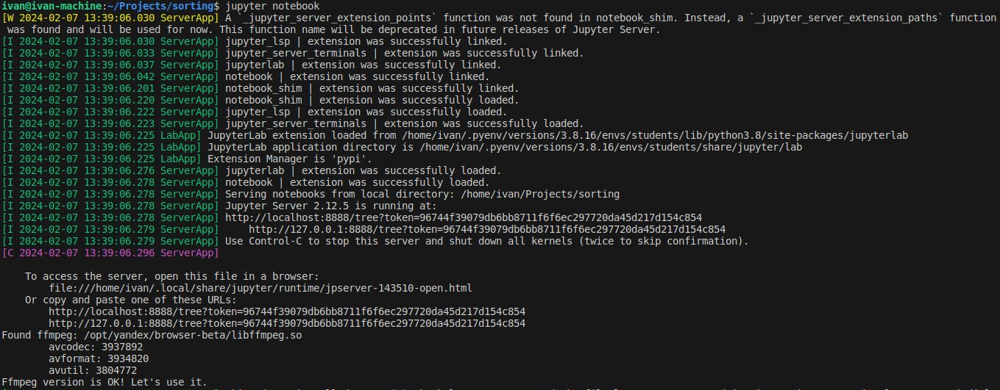

# Описание

Итогом основной части практики будет разработка модели данных зоопарка и определение ограничений данных. С помощью модулей python вам предлагается собрать необходимые данные, провести предварительный анализ и затем загрузить их в БД. 

Собирать данные будем из подготовленных таблиц и с помощью генерации синтетики. Анализ данных сделаем с помощью фреймворка `pandas` и `jupyter notebook`. Нарисуем графики с помощью `seaborn`.

Установка в командной строке
```
pip install -U pip
pip install pandas notebook matplotlib seaborn
```

Для запуска сервера jupyter переходим в каталог, который будет для сервера корневым, затем для запуска `notebook` введите в консоли следующую команду
```
jupyter notebook
```
в случае успешного запуска, вывод будет выглядеть примено так

Если окно браузера не откроется скопирйте адрес из консоли, после подсказки: __"copy and paste one of these URLs"__.

## Подготовка таблицы "Животные"
### Поля таблицы
- name - кличка 
- genus - вид
- class - класс 
- order - отряд
- family - семейство
- gender - пол
- age - возраст в годах
- area - ареал обитания
- life_span - продолжительность жизни
- maturity - зрелость, особь зрелая / не зрелая
- weight - вес в килограммах
- height - рост в сантиметрах
- date_start - дата начала содержания
- date_end - дата заврешения содержания

Данные: [Животные Московского зоопарка](https://drive.google.com/file/d/12ymeRf8LMko1W5A8eXBmQB8JNIeZoLSd/view?usp=drive_link)

Воспользуйтесь таблицей `moscow_zoo.csv` для генерации полей. Поля `weight`, `height` и `age` сгенерируйте, учитывая предоставленные сведения. Поля `name`, `gender`, `maturity` и даты сгенерируйте самостоятельно. 

### Исследование

Исследуйте данные на уникальность видов и наличие пропусков. Для максимальных и минимальных значений роста, веса и продложительности жизни вывести гистограмму распределения, посчитать и вывести описательные статистики: максимальный, минимальный элементы, среднее значение. Сделать выводы.

определить разнообразие сред обитания, подсчитать количество видов по семействам.

